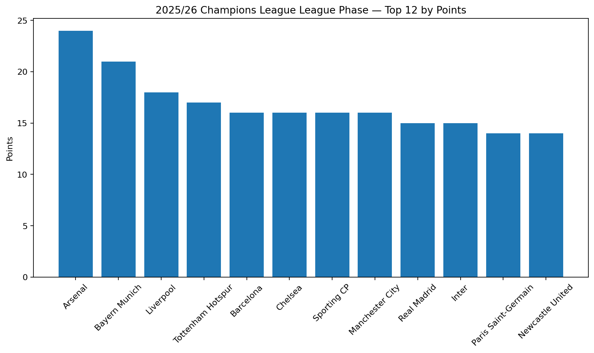
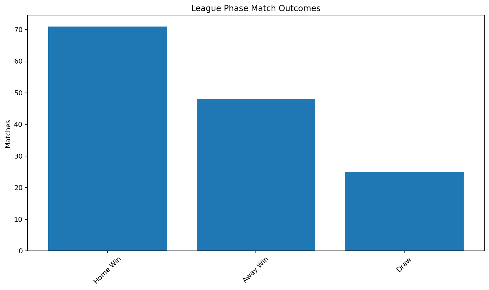
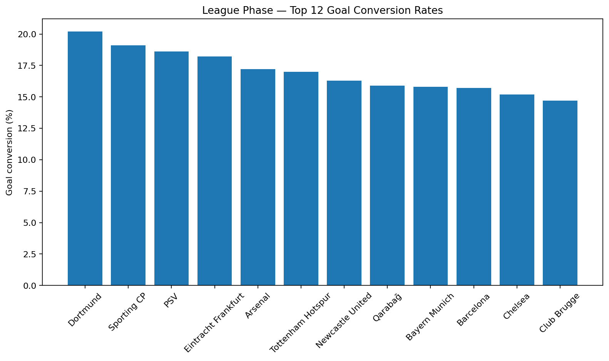

<div align="center">

# UEFA Champions League 2025/26 Analytics

**SQL + Python analysis of the complete 2025/26 Champions League season**

Python · SQL · SQLite · Pandas · Matplotlib · Jupyter

</div>

---

## Project Overview

This project analyzes the **2025/26 UEFA Champions League** using two complementary match datasets:

- a complete competition-results source containing **189 matches** across the league phase and knockout stages;
- a richer match-statistics source containing **144 league-phase matches** with possession, shots, saves, venue and referee information.

The project focuses on a practical analytics workflow: source inspection, data cleaning, cross-source validation, relational modelling, SQL analysis and Python visualization.

The two source scopes are deliberately kept separate. Detailed possession and shooting analysis is performed only for the league phase because the richer dataset does not contain the knockout rounds.

---

## Analytical Questions

The project is designed to answer questions such as:

- Which teams performed best during the league phase?
- How large was home advantage?
- Which clubs combined scoring output with shooting efficiency?
- How did home and away performance differ by team?
- What did five-match rolling form look like?
- How often did the side with more possession actually win?
- Which teams scored and conceded the most across the complete competition?
- How did match characteristics change across tournament stages?
- How should extra-time and penalty-shootout matches be represented correctly in an analytical database?

---

## Data Sources

| Source | Coverage | Main fields used |
|---|---:|---|
| OpenFootball Champions League 2025/26 | 189 matches | dates, stages, teams, scores, half-time scores, extra time, penalties |
| Champions League Matches 2025–2026 dataset | 144 league-phase matches | venue, referee, possession, shots, shots on target, saves |

Source pages are documented in [`data/raw/README.md`](data/raw/README.md).

Raw source files are intentionally excluded from Git tracking. The repository stores the processing logic and analysis rather than redistributing the original datasets.

---

## Data Engineering Workflow

```text
Complete results source                 Detailed league-phase source
       189 matches                               144 matches
            │                                         │
            ▼                                         ▼
   Parse stages/scores                       Clean percentages
   Extra time/penalties                      Parse "x of y" fields
            │                                         │
            └───────────────┬─────────────────────────┘
                            ▼
                   Standardize team names
                            ▼
                   Cross-source validation
                            ▼
                      SQLite database
                            │
              ┌─────────────┴─────────────┐
              ▼                           ▼
          SQL analysis              Python analysis
              │                           │
              └─────────────┬─────────────┘
                            ▼
                    Findings + figures
```

---

## Data Quality and Cleaning

Several realistic cleaning problems are handled explicitly:

- The detailed source contains **151 raw rows**, including **7 empty separator rows**; the pipeline retains the **144 actual matches**.
- Possession values such as `63%` are converted to numeric percentages.
- Shooting values such as `3 of 10` are split into shots on target and total shots.
- The two sources use different club-name conventions, so a canonical team mapping is maintained in [`src/team_mapping.py`](src/team_mapping.py).
- All **144 detailed matches** are joined one-to-one to the full competition source using date, home team and away team.
- All 144 linked scores are validated across both sources.
- Possession totals are 100% for 132 matches and 101% for 12 matches because of source rounding.
- Extra time and penalty shootouts are modelled separately. The final, for example, is represented as a **1–1 match after extra time** with a separate **4–3 penalty shootout**, rather than being treated as a normal 4–3 match.

A detailed field-level description is available in [`docs/data_dictionary.md`](docs/data_dictionary.md).

---

## Database Design

The SQLite database uses three core tables:

```text
teams
  team_id (PK)
  team_name
  country_code

matches
  match_id (PK)
  date
  stage
  matchday
  home_team_id (FK)
  away_team_id (FK)
  goals
  half-time score
  extra-time flag
  penalty-shootout fields

league_phase_stats
  match_id (PK/FK)
  venue
  referee
  possession
  total shots
  shots on target
  saves
  shooting / save percentages
```

This separates full-season result data from the statistics that are only available for the league phase.

---

## SQL Skills Demonstrated

The SQL analysis includes:

`JOIN` · `GROUP BY` · `CASE` · CTEs · `UNION ALL` · conditional aggregation · `ROW_NUMBER()` · `RANK()` · rolling window calculations

Files:

- [`sql/02_data_quality.sql`](sql/02_data_quality.sql) — validation queries
- [`sql/03_team_performance.sql`](sql/03_team_performance.sql) — league table and full-competition team performance
- [`sql/04_home_away_analysis.sql`](sql/04_home_away_analysis.sql) — home/away performance
- [`sql/05_advanced_analysis.sql`](sql/05_advanced_analysis.sql) — rolling form and attacking-efficiency analysis

---

## Initial Findings

The generated analysis currently confirms:

- **36 teams** and **189 matches** are represented in the complete competition dataset.
- The tournament stages contain 144 league-phase matches, 16 knockout play-off matches, 16 Round-of-16 matches, 8 quarter-finals, 4 semi-finals and 1 final.
- Arsenal finished the league phase with **24 points from 8 matches** in the reconstructed league-phase table.
- The final finished **Paris Saint-Germain 1–1 Arsenal after extra time**, with Paris Saint-Germain winning the shootout **4–3**.

Additional generated findings are stored in [`reports/analysis_summary.md`](reports/analysis_summary.md).

### League-phase points



### League-phase match outcomes



### Goal conversion



---

## Player Performance Analysis

The project also includes a position-specific player-ranking layer for the 2025/26 Champions League.

Player statistics are collected from FBref's non-qualifying-round competition tables and transformed into comparable per-90 and percentage metrics. Players are grouped by their primary position and filtered by minimum playing time before scoring.

The analytical model ranks:

- Top 5 forwards
- Top 5 midfielders
- Top 5 defenders
- Top 5 goalkeepers

Each position uses different metrics and weights rather than applying one generic score to every player. The resulting `performance_score` is a within-position analytical score from 0–100, not an official UEFA award.

Detailed methodology: [`docs/player_ranking_methodology.md`](docs/player_ranking_methodology.md)

Generated report: [`reports/player_rankings.md`](reports/player_rankings.md)

Run the full player upgrade after the base pipeline:

```bash
python src/run_player_upgrade.py
python src/validate_player_data.py
```

The upgrade adds `player_metrics` and `player_rankings` tables to the local SQLite database and produces four Top-5 charts under `reports/figures/`.

---

## Repository Structure

```text
champions-league-2025-26-analytics/
├── README.md
├── requirements.txt
├── .gitignore
│
├── data/
│   ├── raw/
│   │   └── README.md
│   └── processed/              # generated locally, ignored by Git
│
├── src/
│   ├── team_mapping.py
│   ├── parse_full_results.py
│   ├── clean_league_stats.py
│   ├── build_database.py
│   ├── validate_data.py
│   ├── run_pipeline.py
│   └── generate_report.py
│
├── sql/
│   ├── 01_schema.sql
│   ├── 02_data_quality.sql
│   ├── 03_team_performance.sql
│   ├── 04_home_away_analysis.sql
│   ├── 05_advanced_analysis.sql
│   ├── 06_player_performance.sql
│   └── 07_position_rankings.sql
│
├── notebooks/
│   └── champions_league_analysis.ipynb
│
├── reports/
│   ├── analysis_summary.md
│   ├── player_rankings.md
│   └── figures/
│
└── docs/
    ├── data_dictionary.md
    └── interview_notes.md
```

---

## Run Locally

### 1. Create a virtual environment

```bash
python -m venv .venv
```

Windows PowerShell:

```powershell
.\.venv\Scripts\Activate.ps1
```

### 2. Install dependencies

```bash
pip install -r requirements.txt
```

### 3. Add the source datasets

Place the two raw files in `data/raw/` as described in [`data/raw/README.md`](data/raw/README.md).

### 4. Run the complete pipeline

```bash
python src/run_pipeline.py
```

### 5. Validate the database

```bash
python src/validate_data.py
```

### 6. Generate the report and figures

```bash
python src/generate_report.py
```

### 7. Open the notebook

```bash
jupyter notebook notebooks/champions_league_analysis.ipynb
```

---

## Interview-Friendly Summary

A concise explanation of the project is available in [`docs/interview_notes.md`](docs/interview_notes.md). It covers the project objective, why two sources were needed, the main cleaning decisions, SQL concepts used and the most important limitation.

---

## Current Scope

This version intentionally focuses on **team and match analytics**. Player-level analysis is outside the current scope so that the project remains consistent, reproducible and straightforward to explain.

The detailed performance dataset covers the league phase only; knockout-stage possession or shooting statistics are therefore not inferred or fabricated.
